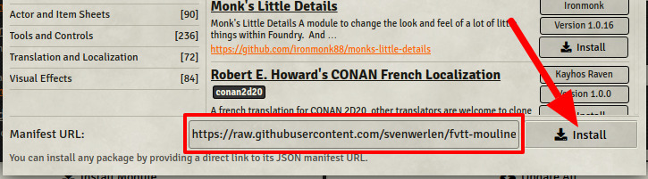

# Moulinette Core (Foundry VTT)

See [www.moulinette.cloud](https://www.moulinette.cloud) website.

Moulinette is a set of tools for importing packs of scenes, images, playlists prepared by the community.

:warning: the core only provides the Moulinette's foundations. You'll have to install additional modules to bring features.

* [Moulinette Scenes](#forge): import scenes into your world. Share your scenes with the community.
* [Moulinette Icons](#fvtt-game): search and import game icons from <a href="https://game-icons.net/" target="_blank">game-icons.net</a>.
* [Moulinette Image search](#fvtt-search): search images and generate articles.
* [Moulinette Tiles](#fvtt-tiles): search tiles and drop them on your maps. Bring your own images and let Moulinette manage them for you.
* [Moulinette Sounds](#fvtt-sounds): Bring your own sounds and let Moulinette manage them for you. Search and play a sound on-the-fly or create a playlist.
* [Moulinette Soundboard](#fvtt-soundboard): Create your own soundboard. Prepare sounds for your games and play them very quickly and easily.
* [Install the module](#install): install the module on your Foundry VTT server.
* [Support me on Patreon](#support)

Watch *Foundry VTT Module Tutorial: Moulinette Forge with Free Forgotten Adventures Assets* from [Baileywiki](https://www.patreon.com/baileywiki​) to have an overview of some of the Moulinette capabilities.

## <a name="forge"/>Moulinette Scenes

[Visit module repository](https://github.com/SvenWerlen/moulinette-scenes)

You're a GM (game master) preparing a new scenario? Moulinette Forge lets you browse a catalog of scenes shared by the community. 
* Search in the catalog
* Have a look at the preview
* Check the scenes you want to import
* Import!

 _(Scenes on the screenshot are from [VenatusMaps](https://www.venatusmaps.com/))_

## <a name="fvtt-game"/>Moulinette Game icons

[Visit module repository](https://github.com/SvenWerlen/moulinette-gameicons)

You need icons for your game (actions, items, etc.). 
* Search <a href="https://game-icons.net/" target="_blank">game-icons.net</a> catalog
* Check the icons you want to import
* Choose your favorite colors (foreground/background)
* Import!

 _(Icons on the screenshot are from [Game-icons.net](https://game-icons.net/) and are provided under [CC BY 3.0](https://creativecommons.org/licenses/by/3.0/) license.)_

## <a name="fvtt-search"/>Moulinette Image search

[Visit module repository](https://github.com/SvenWerlen/moulinette-imagesearch)

You need images to enrich your game/campaign 
* Search using <a href="https://www.bing.com" target="_blank">bing.com</a> engine
* Preview the image
* Download or generate a journal article
* Import!

 _(Images on the screenshot are from [Microsoft Bing](https://www.bing.com) search engine. Images are publicly available but their license varies.)_

## <a name="fvtt-tiles"/>Moulinette Tiles

[Visit module repository](https://github.com/SvenWerlen/moulinette-tiles)

You want to add tiles on your maps?
* Search using Moulinette engine
* See publisher and license (generally [CC BY-NC-SA 4.0](https://creativecommons.org/licenses/by-nc-sa/4.0))
* Drag and drop tiles 
* Voilà!

 _(Tiles on the screenshot are from [Forgotten Adventures](https://www.forgotten-adventures.net/) which are license under [Attribution-NonCommercial-ShareAlike 4.0 International (CC BY-NC-SA 4.0)](https://creativecommons.org/licenses/by-nc-sa/4.0/))_

You created or downloaded some tokens/assets you'd like Moulinette to manage for you?
* Put them in `moulinette/images/custom` folder.
* Make sure to have at least a 2-depth structure (1. Publisher, 2. Pack, 3+ Images)
* Index images
* Moulinette provides you now the same features as for tiles (see above)

 _(Tokens on the screenshot have been downloaded from [Devin's Token Site](https://immortalnights.com/tokens/token-packs/). 20 token packs have been made free to the public.)_

## <a name="fvtt-sounds"/>Moulinette Sounds

[Visit module repository](https://github.com/SvenWerlen/moulinette-sounds)

You created or downloaded some sounds you'd like Moulinette to manage for you?
* Put them in `moulinette/sounds/custom` folder.
* Make sure to have at least a 2-depth structure (1. Publisher, 2. Pack, 3+ Sounds)
* Index sounds
* Moulinette lets you now search or browse sounds
 * Play a sound *on-the-fly*
 * Select sounds and create a playlist

 _(Ambience sounds on the screenshot have been downloaded from [Tabletop Audio](https://tabletopaudio.com/) which are licensed under a [Creative Commons Attribution-NonCommercial-NoDerivatives 4.0 International](https://creativecommons.org/licenses/by-nc-nd/4.0/) License.)_

## <a name="fvtt-soundboard"/>Moulinette Soundboard

You can also create your own soundboard. 
* Sounds can be added by clicking on the "favorite" icon (Moulinette Forge | Audio)
* Moulinette adds a new control on the top left corner for opening the soundboard
* Simply click on the sound to play it
* Sounds can be modified or moved on the soundboard

 _(Icons on the screenshot are from [Game-icons.net](https://game-icons.net/) and are provided under [CC BY 3.0](https://creativecommons.org/licenses/by/3.0/) license.)_

## <a name="install"/>Install the module

To **install** the module from FoundryVTT:
1. Start FVTT and browse to the Game Modules tab in the Configuration and Setup menu
2. Search for "Moulinette Core" and click install

To **manually install** the module (not recommended), follow these instructions:
1. Start FVTT and browse to the Game Modules tab in the Configuration and Setup menu
2. Select the Install Module button and enter the following URL: https://raw.githubusercontent.com/svenwerlen/moulinette-core/master/module.json
3. Click Install and wait for installation to complete 

List of all existing sub-modules:
* https://raw.githubusercontent.com/SvenWerlen/moulinette-scenes/master/module.json
* https://raw.githubusercontent.com/SvenWerlen/moulinette-gameicons/master/module.json
* https://raw.githubusercontent.com/SvenWerlen/moulinette-imagesearch/master/module.json
* https://raw.githubusercontent.com/SvenWerlen/moulinette-tiles/master/module.json
* https://raw.githubusercontent.com/SvenWerlen/moulinette-sounds/master/module.json
* https://raw.githubusercontent.com/SvenWerlen/moulinette-scribe/master/module.json

## <a name="openUI"/>Open Moulinette interface

There are 3 different ways to open the user intervace:
* Shortcut : `CTRL + M`
* Macros available in the Moulinette macros compendium
* Moulinette adds a new control (icon on the top-left corner). Requires a scene to be loaded.

## <a name="support"/>Support me on Patreon

If you like my work and want to support me, consider subscribing to Moulinette!

* Recommended: [Moulinette on Stripe](https://assets.moulinette.cloud/pricing) (requires Patreon authentication)
* Or: [Moulinette on Patreon](https://www.patreon.com/moulinette)

You can also join [Moulinette Discord](https://discord.gg/xg3dcMQfP2)
