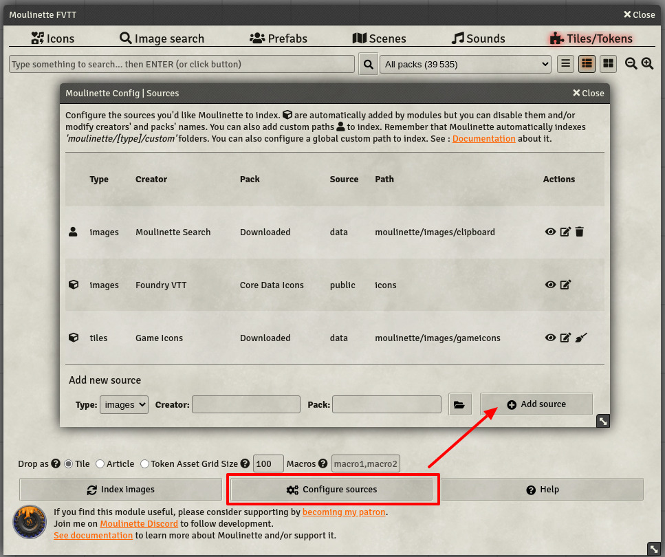

# Moulinette Documentation

Most screenshots on the [Home page](https://github.com/SvenWerlen/moulinette-core) are self-explanatory. 
This page provides additional details as a FAQ.

* [How to index assets provided by other modules?](#how-to-index-assets-provided-by-other-modules)
* [How to bring my assets and let Moulinette manage them?](#how-to-bring-my-assets-and-let-moulinette-manage-them)

## How to index assets provided by other modules?

A lot of existing modules provide assets (sounds, icons, etc.) that you may want to be searchable and usable in Moulinette.
In order to make those assets appear in moulinette, you can follow one of the two techniques below.

### Add folder(s) as source

Moulinette lets you add new sources (folders) to be indexed. Simply click on "Configure Sources" and follow the instructions.



### Ask the creator of module to integrate with Moulinette

Modules can declare their assets during the startup such Moulinette will automatically consider them when indexing assets.
Make a request to the creator of the module with a reference to this documentation. In order to declare one or more packs of assets,
a module simply needs to add the following snippet of code

```javascript
Hooks.once("ready", async function () {
  if(game.moulinette) {
    game.moulinette.sources.push({ type: "images", publisher: "Foundry VTT", pack: "PF1 Icons", source: "data", path: "systems/pf1/icons" })
    ...
  }
});
```

* The if statement checks that moulinette module is available (installed and enabled).
* A module can define as many packs as desired
* `type` can have the value "images", "tokens" or "sounds"
* `publisher` is the name of the creator that is displayed in the dropdown list in moulinette
* `pack` is the name of the pack that is displayed in the dropdown list in moulinette
* `source` can have the value "data" (where modules are installed) or "public" (where FVTT is installed)
* `path` is the relative path to the assets according to the defined source. Assets don't have to be directly in that folder (Moulinette scans subfolders, too). Use the FilePicker to navigate and find the right path.


## How to bring my assets and let Moulinette manage them?

By default, Moulinette expects your assets to be deployed in a specific "custom" folder, depending on the type of asset:
* `moulinette/images/custom/` for images and tiles (`gif`,`jpg`, `jpeg`, `png`, `webp`, `svg`)
* `moulientte/sounds/custom/` for sounds and music (`mp3`, `ogg`, `wav`, `opus`)

In that folder, you need to make sure to have a 2-level structure
```
<level1 - publisher>
  <level 2 - pack>
    <level 3 - assets or subfolders>
    ...
```

* The first level will be identified as "publishers"
* The second level will be used for "packs"
* Moulinette will then scan all assets in that folder (including its subfolders)

## I already have assets in Foundry. Can I reuse them without having to move them into /moulinette/.../custom folders?

Yes, you can use one of those 3 solutions.

### Add your folders as "new source"

*See "How to index assets provided by other modules?" section.*

### Create symbolic links

_(If you don't know what a symbolic link is or how to create it, ignore this solution)_

You can make Moulinette think that your folders are in `/moulinette` folder even if it's not the case. 
For that, you'll need to create symbolic links to your folder. 

```
/moulinette
  /images/custom
    publisher-name-1 (--> link to /your-folder)
    publisher-name-2 (--> link to another folder)
  /sounds/custom
    publisher-name (--> link to /your-folder)
```

### Use advanced configuration (NOT RECOMMENDED)


*This configuration is tech-savvy and should be avoided. Moulinette now supports adding sources (ie folders) to be indexed. This is much easier to use.*

* [Advanced indexing configuration](indexing-advanced.md)

### More help?

You need additional help for configuring this properly? Join us on [Moulinette Discord](https://discord.gg/xg3dcMQfP2)


