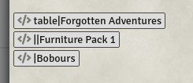

# Moulinette API

This page provides Moulinette API documentation

* [searchUI](#searchui) : opens Moulinette UI and applies filters.
* [assetPicker](#assetpicker) : uses Moulinette as asset picker.

## searchUI

**Target audience** : game masters

**Supported use cases**
* As GM, you frequently use assets from a specific creator or pack and you want Moulinette to open and directly show those assets. You can thus save a few clicks and build your scenes more efficiently.

#### API documentation
* `game.moulinette.applications.MoulinetteAPI.searchUI( module, search )`
  * `module` : `tiles` or `scenes` (depending on what type of asset you want)
  * `search` : terms and filters
    * `terms` : search terms (same as if you would enter them in the search field)
    * `creator` : the exact name of the creator. When specified, Moulinette will only show assets of that creator
    * `pack` : the name of the pack. Can be part of the name (suffix). If multiple packs matches, moulinette will pick the first one.

#### Examples

```javascript
// search for all assets matching "table" of creator "Forgotten Adventures"
game.moulinette.applications.MoulinetteAPI.searchUI("tiles", {
  terms: "table", creator: "Forgotten Adventures"})

// open Moulinette UI on pack "Furniture Pack 1"
game.moulinette.applications.MoulinetteAPI.searchUI("tiles", {
  pack: "Furniture Pack 1"})

// open Moulinette UI and show scenes from "Bobours"
game.moulinette.applications.MoulinetteAPI.searchUI("scenes", {
  creator: "Bobours", pack: "Maps"})
```

#### Macros

Moulinette also provides macros such this API can be used in journal articles.
* Import the macros "MouScenes" and "MouTiles" from the Moulinette Core compendium.
* In a journal article, you can then use `@Macro[MouTiles]{search}` or `@Macro[MouScenes]{search}`

```javascript
// search for all assets matching "table" of creator "Forgotten Adventures"
@Macro[MouTiles]{table|Forgotten Adventures}

// open Moulinette UI on pack "Furniture Pack 1"
@Macro[MouTiles]{||Furniture Pack 1}

// open Moulinette UI and show scenes from "Bobours"
@Macro[MouScenes]{|Bobours}

```



## assetPicker

**Target audience** : module/world developers

**Supported use cases**
* As developer, you have a partnership with a creator (or you're a creator) and you want your module to provide a file picker to browse assets from 1 specific creator or pack.

#### API documentation
* `game.moulinette.applications.MoulinetteAPI.assetPicker( callback, search )`
  * `callback` : a function that Moulinette must call after the end-user picked an asset
  * `search` : terms and filters
    * `terms` : search terms (same as if you would enter them in the search field)
    * `creator` : the exact name of the creator. When specified, Moulinette will only show assets of that creator
    * `pack` : the name of the pack. Can be part of the name (suffix). If multiple packs matches, moulinette will pick the first one.

#### Examples

**Note : in the examples below, the callback function simply outputs the path of the selected asset into the console (F12)**

```javascript
// open a FilePicker showing all assets matching "table" of creator "Forgotten Adventures"
game.moulinette.applications.MoulinetteAPI.assetPicker(
  (path) => { console.log("Selected path = " + path)},
  { terms: "table", creator: "Forgotten Adventures" }
)

// open a FilePicker showing all assets of pack "Furniture Pack 1"
// notice : you need to specify 1 space as terms to force Moulinette to show the entire list
game.moulinette.applications.MoulinetteAPI.assetPicker(
  (path) => { console.log("Selected path = " + path)},
  { terms: " ", pack: "Furniture Pack 1" }
)

```

### More help?

You need additional help? Join us on [Moulinette Discord](https://discord.gg/xg3dcMQfP2)
